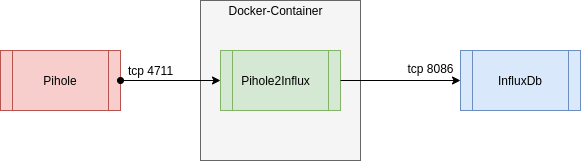

# Pihole2Influx
This tool, inside of the docker-container, gets data from a Pihole-DNS-Resolver, especially the FTLDNS (Faster than light dns), convert and put them into a influxdb timeseries database.

## What makes this tool different from other tools? 
The data will catched via the telnet-interface of pihole. 
With this interface, it collects much more data as of using the web-Restful-API.

## Prerequisites
If you try this tool, please notice that you enable the telnet interface, on the pihole device, for all devices if you plan to run the container outside of the pihole server.
Please follow the link for a description how you enable telnet for any network device.
<a href="https://docs.pi-hole.net/ftldns/configfile/#socket_listening" target="blank">Link to ftl dns documentation</a>

## Specs
The tool is written with C# but the used language is not so important, because the tool runs completely in a docker-container and you can run it everywhere where docker runs.
The following image demonstrates the dataflow and the "position" of the application inside your technical landscape.

## Environment variables
You can configure the tool with the following docker environment-variables:
- PIHOLEHOST - IP-Address or hostname of pihole [default = 127.0.0.1] 
- PIHOLEPORT - TCP-Port of the telnet port of pihole [default = 4711]
- PIHOLEUSER - If the telnet connection for pihole ist secured, here is the place for the username [default = ""]
- PIHOLEPASSWORD - If the telnet connection for pihole is secured, here is the place for the password [default = ""]
- INFLUXDBHOST - IP-Address or hostname of the InfluxDb time series database [default = 127.0.0.1]
- INFLUXDBPORT - TCP-Port of the InfluxDb time series database [default = 8086]
- INFLUXDBNAME - The database name where the data will be stored [default = influxdb]
- INFLUXDBUSERNAME - If the InfluxDb database is secured, here is the place for the username [default = ""]
- INFLUXDBPASSWORD - If the InfluxDb database is secured, here is the place for the password [default = ""]

### State
Currently, the tool ist in absolutely alpha stadium.

What works:
<ul>
<li>Basic Telnet-Connection</li>
<li>The Dockerfile with all the things that we need</li>
<li>The Base-Implementation</li>
<li>Get some statistics from pihole and print them to console 
Currently they are:
<ul>
<li>Standard Pihole Statistics</li>
<li>Informations about pihole's cache</li>
<li>List of top permitted domains</li>
<li>List of top blocked domains</li>
<li>List of query-types (e.g. A, AAAA, DS)</li>
</ul>
</li>
</ul>

What is missing:
<ul>
<li>Write the data to influxdb</li>
<li>Create a default dashboard for influx</li>
<li>Get all possible data from pihole 
<ul>
<li>List of top clients</li>
<li>List of forward destinations (cache, dns, block)</li>
<li>Version information</li>
<li>database statistics</li>
<li>overtime</li>
</ul>
</li>
<li>many tests</li>
</ul>

