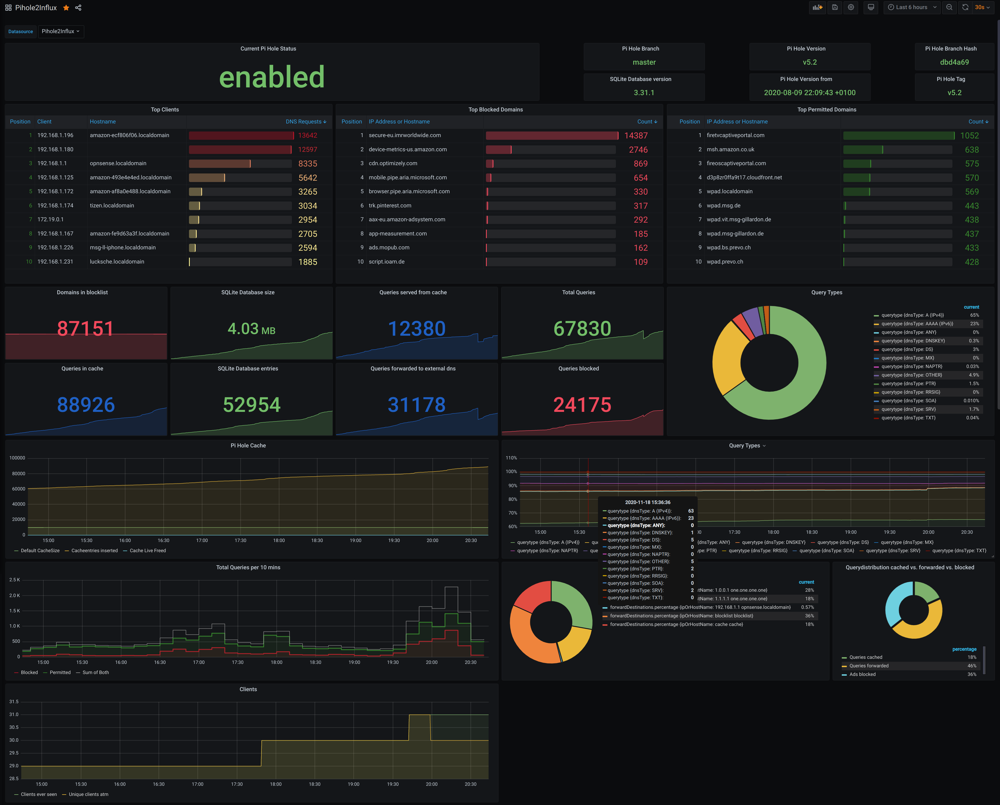

# Pihole2Influx
This tool, inside of the docker-container, gets data from a Pihole-DNS-Resolver, especially the FTLDNS (Faster than light dns), convert and put them into a influxdb timeseries database.

## What makes this tool different from other tools? 
The data will catched via the telnet-interface of pihole. 
With this interface, it collects much more data as of using the web-Restful-API.

## Prerequisites
If you try this tool, please notice that you enable the telnet interface, on the pihole device, for all devices if you plan to run the container outside of the pihole server.
Please follow the link for a description how you enable telnet for any network device.
<a href="https://docs.pi-hole.net/ftldns/configfile/#socket_listening" target="blank">Link to ftl dns documentation</a>

It would be very helpful if you have knowledge with the following technologies. There is a big chance that all things runs out of the box, but I assume that you are familiar with the basic things below
- <a href="https://www.docker.com/" target="_blank">Docker</a> - installation and run the docker system
- <a href="https://www.influxdata.com/" target="_blank">InfluxDb</a> - installation and runnable system. Create and manage time series databases
- <a href="https://grafana.com/" target="_blank">Grafana</a> - installation and runnable system. Create and manage dashboards.

Docker is no need. You can build and run the complete system, please follow the instructions as described in the <a href="install.md">installation documentation</a>.

## Specs
The tool is written with C# but the used language is not so important, because the tool runs completely in a docker-container and you can run it everywhere where docker runs.
The following image demonstrates the dataflow and the "position" of the application inside your technical landscape.

## Installation
Please look in the <a href="install.md">installation document</a> and check what you need to run the container.

### State
Currently, the tool ist a stable beta stadium. That means, the container runs on my system since 3 days without any problem.
I could'nt see any leaks or high memory consumption. The whole container needs 50Mb ram.

What works:
<ul>
<li>Basic Telnet-Connection</li>
<li>The Dockerfile with all the things that we need</li>
<li>The Base-Implementation</li>
<li>Get some statistics from pihole and print them to console 
Currently they are:
<ul>
<li>Standard Pihole Statistics</li>
<li>Informations about pihole's cache</li>
<li>List of top permitted domains</li>
<li>List of top blocked domains</li>
<li>List of query-types (e.g. A, AAAA, DS)</li>
<li>List of forward destinations (cache, dns, block)</li>
<li>List of top clients</li>
<li>overtime</li>
<li>Version information</li>
<li>database statistics</li>
</ul>
</li>
<li>Write the data to influxdb</li>
<li>Create a default dashboard for influx</li>
</ul>

What is missing:
<ul>
<li>better test coverage (currently only 70%)</li>
</ul>

## How it looks?
If all is up and running, you should checkoud the sample grafana dashboard and it shoulld looking like the following screenshot.

